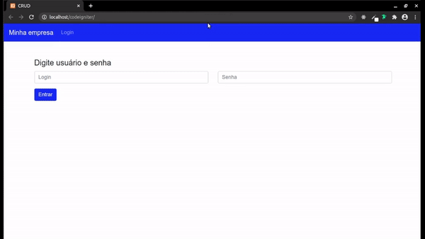

# Painel Crud com CodeIgniter :computer: :fire:
Desenvolvimento de painel CRUD para aplicação de conceitos de backend.

## Preview ##

## Setup ##
Em um servidor XAMPP ou similar, inicie o Apache e o MySQL, e crie um novo banco de dados nomeado como "codeigniter". Acesse o app em http://localhost/codeigniter/.
Para login utilize o usuário "admin" e a senha "1234".
